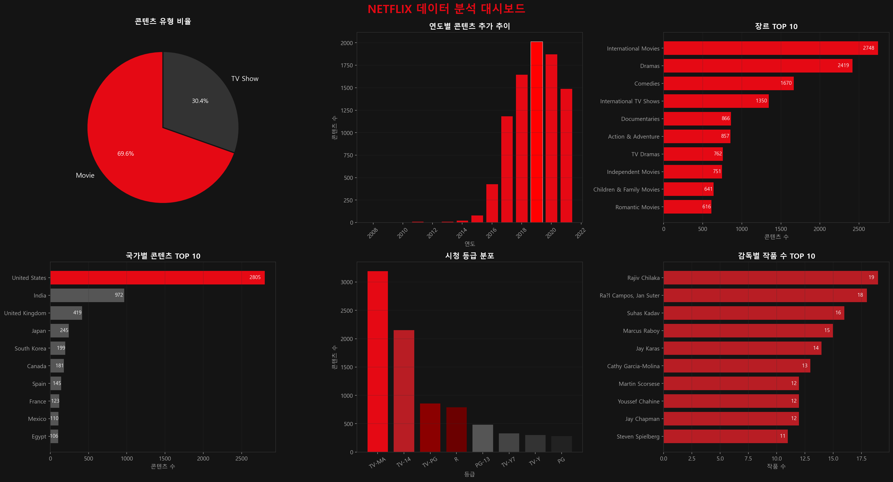
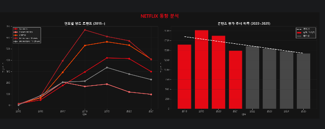

# 🎬 Netflix 데이터 분석 포트폴리오

## 📌 핵심 요약
- 문제: 어떤 콘텐츠가 넷플릭스에서 인기를 끄는지 분석
- 결과: 특정 장르와 국가 콘텐츠 집중
- 결론: 콘텐츠 전략 및 추천 시스템 개선 필요

## 📌 프로젝트 개요
넷플릭스 콘텐츠 데이터를 MySQL과 Python으로 분석한 포트폴리오입니다.

## 🎯 문제 정의
이 프로젝트는 넷플릭스 콘텐츠 데이터를 분석하여 인기 콘텐츠의 특징을 파악하고, 콘텐츠 기획 및 추천 전략에 활용하기 위해 진행했습니다.

## 🛠️ 사용 기술
- **Database**: MySQL
- **Language**: Python
- **Library**: Pandas, Matplotlib, SQLAlchemy

## 📊 분석 내용
1. Movie vs TV Show 비율
2. 연도별 콘텐츠 추가 추이
3. 국가별 콘텐츠 TOP 10
4. 시청 등급 분포
5. 장르 TOP 10
6. 감독별 작품 수 TOP 10

## 📈 대시보드

💡 핵심 인사이트
- Movie가 전체의 69.6%로 TV Show보다 많음 → 영화 중심 콘텐츠 전략 유지
- 2019년에 콘텐츠 추가 최고조 → 이후 전략 변화 시점
- 미국이 전체 콘텐츠의 약 32% 차지 → 특정 국가 편중 현상 존재
- TV-MA 등급이 36.4% → 성인 대상 콘텐츠 비중 높음

## 📂 파일 구조
- `main.py` - Python 분석 및 시각화 코드
- `analysis_queries.sql` - MySQL 분석 쿼리
- `netflix_dashboard.png` - 시각화 결과

## 📈 동향 분석

## 📊 트렌드 해석
- 2019년 이후 콘텐츠 감소는 전략 변화로 해석 가능
- 양적 확대에서 질적 콘텐츠 중심으로 전환
- 특정 장르(Drama, Comedy)는 지속적인 수요 존재

### 장르 트렌드 (2015~)
- International Movies가 꾸준히 1위 유지
- 2019년 이후 전체적으로 감소 추세
- Dramas, Comedies 장르가 꾸준히 인기

### 콘텐츠 증가 추세 예측 (2022~2025)
- 2019년 정점 이후 콘텐츠 추가 감소
- 넷플릭스가 양보다 질 전략으로 전환한 것으로 분석
- 2025년까지 감소 추세 지속 예측

## 🚀 결론 및 활용 방안
- 인기 장르(Drama, Comedy) 중심 콘텐츠 강화 필요
- 국가별 콘텐츠 다양화 전략 필요 (미국 편중 완화)
- 성인 콘텐츠 중심 전략 유지 가능
- 추천 시스템에 장르/국가 데이터 반영 시 사용자 만족도 향상 가능

## 📈 기대 효과
- 사용자 맞춤 콘텐츠 추천 정확도 향상
- 인기 콘텐츠 집중으로 시청 시간 증가
- 글로벌 시장 확장 전략 수립 가능
